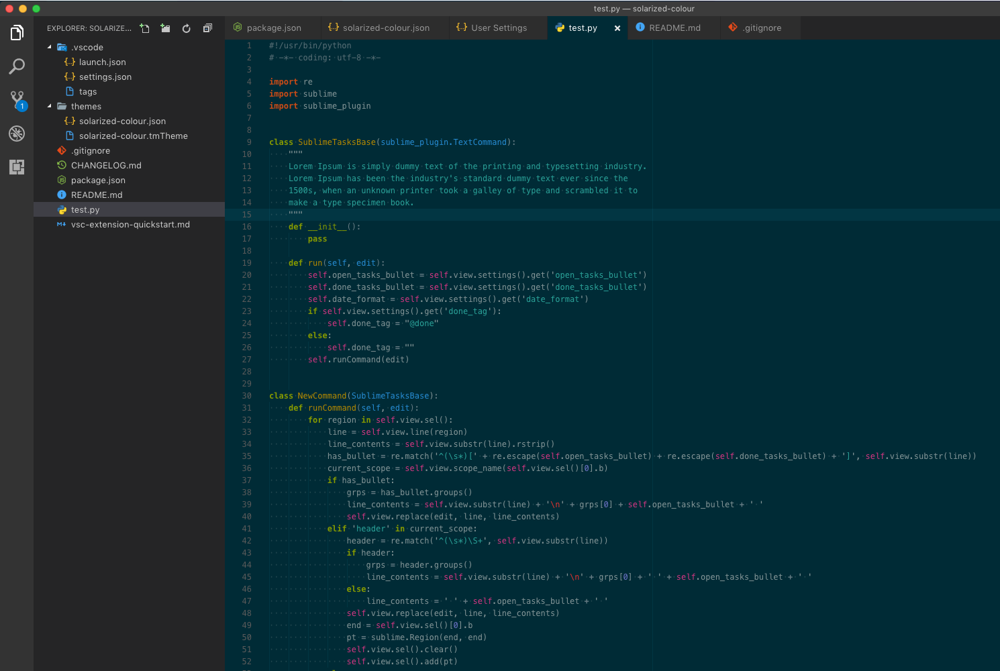

# Solarized (Colour)
Solarized dark with some additional colours and bold keywords

## Installation
1. Clone the repo into your VS code extensions folder `git clone https://github.com/crintus/solarized-colour.git vscode/extensions/solarized-colour`

2. Reload your VS Code if it is open

3. Select Solarized (Colour) as your theme in VS Code

## Screenshot
